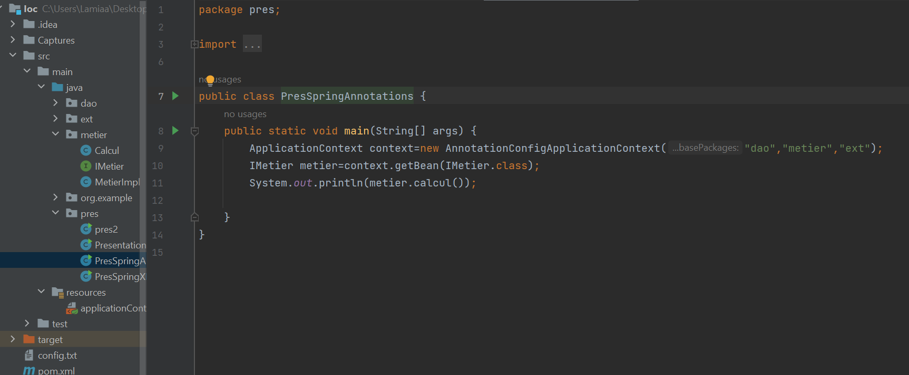

<h3> Mise en oeuvre de l'injection des dépendances</h3>

<h5> 1. Créer l'interface IDao avec une méthode getDate</h5>

<h5>2. Créer une implémentation de cette interface</h5>

<h5>3. Créer l'interface IMetier avec une méthode calcul</h5>

<h5>4. Créer une implémentation de cette interface en utilisant le couplage faible</h5>

<h5>5. Injection des dépendances par instanciation statique</h5>

<h5>6. Injection des dépendances par instanciation dynamique</h5>

<h5>7. Injection des dépendances En utilisant le Framework Spring version XML </h5>

<h5>8. Injection des dépendances En utilisant le Framework Spring version Annotations</h5>

